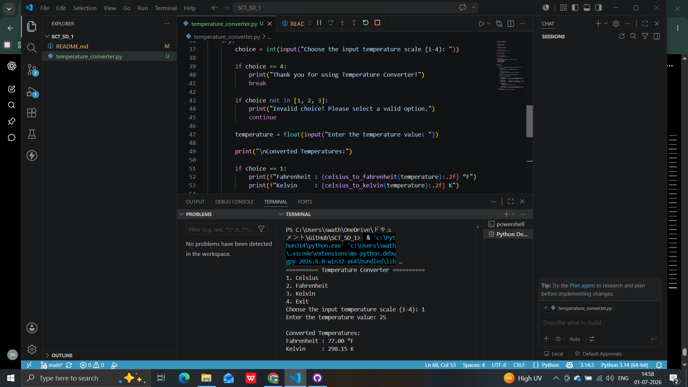

# 🌡️ Temperature Converter

## SkillCraft Technology – Software Development Internship

### 📌 Task 1: Temperature Converter

## 📖 Project Description

This project is a Python-based **Temperature Converter** that allows users to convert temperatures between **Celsius (°C)**, **Fahrenheit (°F)**, and **Kelvin (K)**.

The application provides a simple menu-driven interface where users can select the input temperature scale, enter a temperature value, and instantly view the converted values in the other two temperature scales.

This project was developed as part of the **SkillCraft Technology Software Development Internship**.

---

## ✨ Features

- 🌡️ Convert Celsius to Fahrenheit and Kelvin
- 🌡️ Convert Fahrenheit to Celsius and Kelvin
- 🌡️ Convert Kelvin to Celsius and Fahrenheit
- 📋 Menu-driven interface
- ✅ Input validation
- ⚠️ Error handling using `try-except`
- 🚫 Prevents invalid Kelvin values
- 🔄 Allows multiple conversions without restarting the program
- 💻 Simple and user-friendly console application

---

## 🛠️ Technologies Used

- Python 3
- Visual Studio Code
- Git
- GitHub

---

## 📂 Project Structure

```text
SCT_SD_1/
│
├── temperature_converter.py
├── README.md
└── screenshots/
    └── output.png
```

---

## ▶️ How to Run

1. Clone this repository.
2. Open the project folder.
3. Open Terminal or Command Prompt.
4. Run the following command:

```bash
python temperature_converter.py
```

5. Choose the temperature scale.
6. Enter the temperature value.
7. View the converted results.

---

## 📸 Output Screenshot



---

## 📚 Python Concepts Used

- Functions
- Conditional Statements
- Loops
- Exception Handling
- User Input
- String Formatting
- Modular Programming

---

## 🎯 Learning Outcomes

Through this project, I learned:

- Implementing temperature conversion formulas
- Designing a menu-driven Python application
- Using functions to improve code organization
- Handling invalid user input using exception handling
- Writing clean, readable, and reusable Python code
- Managing projects using Git and GitHub

---

## 🚀 Future Improvements

- Develop a graphical user interface (GUI) using Tkinter.
- Add a conversion history feature.
- Allow users to save conversion results.
- Improve the overall user interface and user experience.

---

## 👩‍💻 Author

**Swathi Niddena**

Software Development Intern

SkillCraft Technology

---

## 📌 Internship Details

- **Organization:** SkillCraft Technology
- **Track:** Software Development Internship
- **Task:** Task 1 – Temperature Converter

---

## ⭐ Acknowledgement

This project was completed as part of the **SkillCraft Technology Software Development Internship** to strengthen Python programming skills, problem-solving abilities, and software development practices.